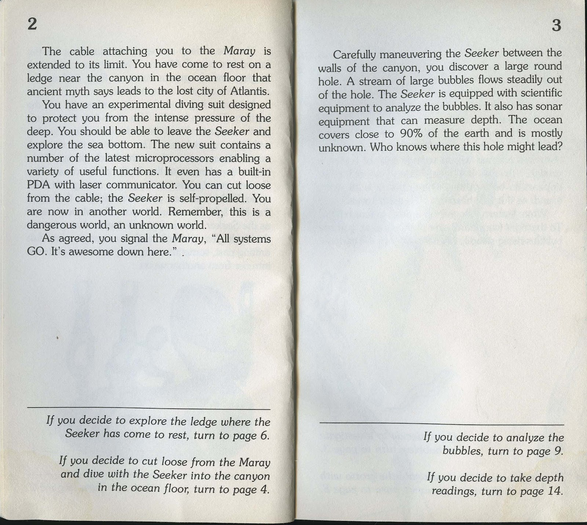

## Conditional Code **Smells**
#### Eric Roberts | _@eroberts_

---

## What is conditional logic?

---

Conditional statements are features of a programming language which perform different computations or actions depending on whether a programmer-specified boolean condition evaluates to true or false. Apart from the case of branch predication, this is always achieved by selectively altering the control flow based on some condition.

<sup>— Wikipedia</sub>

---

``` ruby
    if thing
      puts 'hello'
    else
      puts 'goodbye'
    end
```

---

``` ruby
	thing ? puts 'hello' : puts 'goodbye'
```
---

``` ruby
	puts 'hello' if thing
	
	puts 'goodbye' unless thing
```

---

``` ruby
    case thing
    when Hello
      puts 'hello'
    when Goodbye
      puts 'goodbye'
    else
      puts 'uh oh..'
    end
```

---

## So, why's this bad?

---

## Good question

---

## It's not

---

## But it can be

---

## What are Code Smells?

---

Code smells are not __*technically*__ incorrect and do not prevent the program from functioning. 

---

Instead, they __*indicate weaknesses*__ in design that may be slowing down development or increasing the risk of bugs in the future.

<sub>— [Wikipedia](http://en.wikipedia.org/wiki/Code_smell)</sub>

---

## Let's take a look

---

``` ruby
    if thing
      puts 'hello'
    else
      puts 'goodbye'
    end
```

---

``` ruby
    if thing
      puts 'hello'
    elsif other_thing
      puts 'auf wiedersehen'
    else
      puts 'goodbye'
    end
```
---

``` ruby
    if thing
      puts 'hello'
    elsif other_thing
      puts 'auf wiedersehen'
    elsif another_thing
      puts 'bonjour'
    else
      puts 'goodbye'
    end
```
---

``` ruby
    if thing
      puts 'hello'
    elsif other_thing
      if going
        puts 'auf wiedersehen'
      else
        puts 'hallo'
      end
    elsif another_thing
      puts 'bonjour'
    else
      puts 'goodbye'
    end
```
---

Well, this is just getting out of hand, isn't it?

---

``` ruby
def pricing_range_fold_and_save(new_range)
  pos = 0
  pricings = self.pricings
  other_range = Pricing.new
  if pricings.length == 0
    pricings.push(new_range)
  else
    pricings.each_with_index do |e, i|
      if i == 0 && new_range.start_date < e.start_date
        pricings.unshift(new_range)
        if new_range.end_date <= e.end_date
          e.start_date = new_range.end_date + 1.day
          break
        else
          while pricings[1].present? && new_range.end_date >= pricings[1].end_date
            pricings[1].destroy
            pricings.delete pricings[1]
          end
          if pricings[1].present?
            pricings[1].start_date = new_range.end_date + 1.day
          end
          break
        end
      elsif new_range.start_date <= e.end_date && new_range.start_date >= e.start_date
        if new_range.end_date < e.end_date
          other_range = e.dup
          other_range.start_date = new_range.end_date + 1.day
          if new_range.start_date == e.start_date
            e.destroy
            pricings.delete e
            i -= 1
          else
            e.end_date = new_range.start_date - 1.day
          end
          pricings.insert(i+1, new_range)
          pos = i+1
          pricings.insert(i+2, other_range)
          break
        else
          if new_range.start_date == e.start_date
            e.destroy
            pricings.delete e
            i -= 1
          else
            e.end_date = new_range.start_date - 1.day
          end
```
    
---

``` ruby
          pricings.insert(i+1, new_range)
          pos = i+1
          while pricings[i+2].present? && new_range.end_date >= pricings[i+2].end_date
            pricings[i+2].destroy
            pricings.delete pricings[i+2]
          end
          if pricings[i+2].present?
            pricings[i+2].start_date = new_range.end_date + 1.day
          end
          break
        end

      elsif i == pricings.size-1
        pricings[i].end_date = new_range.start_date-1.day
        pricings.push(new_range)
        break
      end
    end
  end

  pricings.each_with_index do |pricing, i|
    if i != pricings.size-1 && pricing.price ==pricings[i+1].price
      pricing.end_date = pricings[i+1].end_date
    end
    if i != 0 && pricing.end_date == pricings[i-1].end_date
      pricing.destroy
      pricings.delete pricing
    end
    if pricing.end_date < pricing.start_date
      pricing.destroy
      pricings.delete pricing
    end
  end

  pricings.each do |pricing|
    if pricing != pricings[pos]
      pricing.currency = pricings[pos].currency
      pricing.save
    end
  end
  pricings[pos].save
  return pricings
end
  
```
---



## Remember choose your own adventure books?

---

Conditional code can be like reading a choose your own adventure book from front to back.

---

This next bit is from Avdi Grimm's excellent book, Confident Ruby

---


---


---


---


---


---


---


---


---


---


---


---


---


---


---


---


---


---


---

## So, we all know what's going on right?

^ No? Well don't feel too bad. That was kind of the point. Too much conditional logic can make your code difficult to understand and reason about.

---

## OK, so how do I fix it?

^ Discuss that we will go through a few examples

---

## Common Interfaces

---

``` ruby
	class Mailing
	  belongs_to :owner, polymorphic: true
	  
	  def company
	  end
	end
```

---

``` ruby
	class Company
	  has_many :campaigns
	  has_many :mailings, as: :owner
	end
	
	class Campaign
	  belongs_to :company
	  has_many :mailings, as: :owner
	end
```

---

``` ruby
	class Mailing
	  belongs_to :owner, polymorphic: true
	  
	  def company
	  	if owner.is_a? Company
	  	  owner
	  	else
	  	  owner.company
	  	end
	  end
	end
```

---

``` ruby
	class Mailing
	  belongs_to :owner, polymorphic: true
	  
	  def company
	  	owner.company
	  end
	end
```

---

``` ruby
	class Mailing
	  belongs_to :owner, polymorphic: true
	  delegate :company, to: :owner
	end
```

---

``` ruby
	class Company
	  has_many :campaigns
	  has_many :mailings, as: :owner
	  
	  def company
	    self
	  end
	end
```

---

``` ruby
	company = Company.new
	mailing = Mailing.new(owner: company)
	mailing.company
	
	campaign = Campaign.new(company: company)
	mailing = Mailing.new(owner: campaign)
	mailing.company
		
```

---

## Use inheritance
### __Sandi Metz__, [All the Little Things](https://www.youtube.com/watch?v=8bZh5LMaSmE)

---

``` ruby
class GildedRose
  attr_reader :name, :quality, :days_remaining
	  
  def initialize(name, quality, days_remaining)
	@name, @quality, @days_remaining = name, quality, days_remaining
  en
  
  def tick
    [...]
  end
end
```

---

``` ruby
def tick
  days_remaining -= 1
  
  if name == 'Aged Brie'
    quality -= 1
  elsif name == 'Sulfuras, Hand of Ragnaros'
    quality += 1
  end
end
```

---

``` ruby
class GildedRose
  attr_reader :name, :quality, :days_remaining
	  
  def initialize(name, quality, days_remaining)
	@name, @quality, @days_remaining = name, quality, days_remaining
  en
  
  def tick
	days_remaining -= 1
  end
end
```

---

``` ruby
class AgedBrie < GildedRose
  def tick
    super
    quality -= 1
  end
end
```

---

``` ruby
class Sulfuras < GildedRose
  def tick
    super
    quality += 1
  end
end
```

---

``` ruby
class GildedRose
  [...]
  
  def self.klass_for(name)
    {
      'Aged Brie' => AgedBrie,
      'Sulfuras, Hand of Ragnaros' => Sulfuras
    }
  end
end
```

---

``` ruby
thing = GildedRose.klass_for('Aged Brie')
thing.tick

thing = GildedRose.klass_for('Sulfuras, Hand of Ragnaros')
thing.tick
```

---

## Use Special Case Objects

---

``` ruby
	if current_user
	  "Hello, #{current_user.name}"
	else
	  "Hello, Guest"
	end
```

---

``` ruby
	def user
	  current_user || GuestUser.new
	end
	
	class GuestUser
	  def name
	    "Guest"
	  end
	end
```

---

``` ruby
	"Hello, #{user.name}"
```

---

## Use Hash#fetch
### __Avdi Grimm__, [Confident Ruby](http://www.confidentruby.com/)

---

``` ruby
    def create_user(options)
      login = options[:login]
      
      unless login
        raise ArgumentError, 'login must be supplied'
      end
    end
```

---

``` ruby
    def create_user(options)
      login = options.fetch(:login)
    end
```

^ Make a note that this will raise a KeyError rather than an ArgumentError

---

``` ruby
    def create_user(options)
      login = options.fetch(:login, 'default_login')
    end
```

---

``` ruby
	things = {
	  foo: {
	    bar: :baz 
	  } 
	}
```

---

``` ruby
	if things[:foo]
	  things[:foo][:bar]
	end
```

---

``` ruby
	things.fetch(:foo, { bar: nil })[:bar]	
```

---

## Use Enumerable

--- 

This one's going to take a little longer...

---

``` ruby
def pricing_range_fold_and_save(new_range)
  pos = 0
  pricings = self.pricings
  other_range = Pricing.new
  if pricings.length == 0
    pricings.push(new_range)
  else
    pricings.each_with_index do |e, i|
      if i == 0 && new_range.start_date < e.start_date
        pricings.unshift(new_range)
        if new_range.end_date <= e.end_date
          e.start_date = new_range.end_date + 1.day
          break
        else
          while pricings[1].present? && new_range.end_date >= pricings[1].end_date
            pricings[1].destroy
            pricings.delete pricings[1]
          end
          if pricings[1].present?
            pricings[1].start_date = new_range.end_date + 1.day
          end
          break
        end
      elsif new_range.start_date <= e.end_date && new_range.start_date >= e.start_date
        if new_range.end_date < e.end_date
          other_range = e.dup
          other_range.start_date = new_range.end_date + 1.day
          if new_range.start_date == e.start_date
            e.destroy
            pricings.delete e
            i -= 1
          else
            e.end_date = new_range.start_date - 1.day
          end
          pricings.insert(i+1, new_range)
          pos = i+1
          pricings.insert(i+2, other_range)
          break
        else
          if new_range.start_date == e.start_date
            e.destroy
            pricings.delete e
            i -= 1
          else
            e.end_date = new_range.start_date - 1.day
          end
```

^ Surprisingly, we get a bug report.

---

## Adding a new pricing
# Screwed up the rest of my Year

---

Time to start reading...

---

``` ruby
	def pricing_range_fold_and_save(new_range)
	  pos = 0
	  pricings = self.pricings
	  other_range = Pricing.new
      if pricings.length == 0
        pricings.push(new_range)
  	  else
```

^ OK, so it looks like we're setting some variables for some reason. I can guess that pos means position. We're getting the pricings from self (which is property) and we're setting some variable named other range.

^ Looks like if there are no pricings, we just add our new thing.

----

``` ruby
	pricings.each_with_index do |e, i|
      if i == 0 && new_range.start_date < e.start_date
        pricings.unshift(new_range)
        if new_range.end_date <= e.end_date
          e.start_date = new_range.end_date + 1.day
          break
        else
          while pricings[1].present? && new_range.end_date >= pricings[1].end_date
            pricings[1].destroy
            pricings.delete pricings[1]
          end
          if pricings[1].present?
            pricings[1].start_date = new_range.end_date + 1.day
          end
          break
        end
```

^ While the badger is a hedgehog, and the princess is in the castle...

---

OK, enough of that. What do the tests say?

---

``` ruby
require 'spec_helper'
	
describe Property do
  pending "add some examples to (or delete) #{__FILE__}"
end

```

---

Alrighty then...

---

### So, what is this supposed to do?

---


---


---

# Magic

---

1 - If the new price completely covers an old price, delete the old price.

---

2 - Adjust overlapping pricings.

---

3 - Split prices that fully contain the new price.

---

4 - Expand the range to meet the new price.

---

5 - Combine pricings where the pricings match.

---

``` ruby
class PricingRange
  attr_reader :property
  
  def initialize(property)
  	@property = property
  end
  
  def add(pricing)
  	delete_complete_overlaps(pricing)
	adjust_overlaps(pricing)
	split_containing(pricing)
	expand_to_meet(pricing)
	coalesce_pricings
  end
end

```

---

``` ruby
class PricingRange
  [...]
  
  def add(pricing)
  	delete_complete_overlaps(pricing)
  	[...]
  end
end
```

---

## Delete Complete Overlaps

---

``` ruby
def delete_complete_overlaps(new)
  pricings.each do |old|
	if new.start_date <= old.start_date && new.end_date >= old.end_date
	  pricings.delete old
	end
  end
end
```

---

``` ruby
def delete_complete_overlaps(new)
  to_delete = pricings.select do |old|
  	new.start_date <= old.start_date && new.end_date >= old.end_date
  end
  
  pricings.delete to_delete
end
```

---

``` ruby
new.start_date <= old.start_date && new.end_date >= old.end_date
```

---

``` ruby
class PricingRange
  [...]
  
  def contains?(pricing1, pricing2)
    pricing1.start_date <= pricing2.start_date && pricing1.end_date >= pricing2.end_date
  end
end
```

^ This seems like something that belongs on the pricing class.
^ Doesn't refer to self at all

---

``` ruby
class Pricing
  [...]
  
  def contains?(other)
    self.start_date <= other.start_date && self.end_date >= other.end_date
  end
end
```

---

``` ruby
def delete_complete_overlaps(new)
  to_delete = pricings.select { |old| new.contains? old }
  pricings.delete to_delete
end
```

---

``` ruby
def delete_complete_overlaps(new)
  pricings.each do |old|
	if new.start_date <= old.start_date && new.end_date >= old.end_date
	  pricings.delete old
	end
  end
end
```

---

``` ruby
def delete_complete_overlaps(new)
  to_delete = pricings.select { |old| new.contains? old }
  pricings.delete to_delete
end
```

---

## Adjust Overlaps

---

``` ruby
class PricingRange
  [...]
  
  def adjust_overlaps(new)
    adjust_overlaps_of_start(new)
    adjust_overlaps_of_end(new)
  end
end
```

---

## Overlapping Start

---

``` ruby
def adjust_overlaps_of_start(new)
  pricings.each do |old|
    if new.start_date <= old.start_date && new.end_date >= old.start_date
      old.start_date = new.end_date + 1.day
      old.save!
     end
  end
end
```

---

``` ruby
def adjust_overlaps_of_start(new)
  to_adjust = pricings.select do |old|
    new.start_date <= old.start_date && new.end_date >= old.start_date
  end
  
  to_adjust.each do |pricing|
    pricing.start_date = new.start_date + 1.day
    pricing.save!
  end
end
```

---

``` ruby
class Pricing
  [...]
  
  def overlaps_start_of?(other)
    self.start_date <= other.start_date && self.end_date >= other.start_date
  end
end
```

---

``` ruby
def adjust_overlaps_of_start(new)
  to_adjust = pricings.select { |old| new.overlaps_start_of? old }
  
  to_adjust.each do |pricing|
    pricing.start_date = new.start_date + 1.day
    pricing.save!
  end
end
```

^ This looks like the last one, but are we done?

---

``` ruby
def adjust_overlaps_of_start(new)
  overlapped = pricings.find { |old| new.overlaps_start_of? old }
  overlapped.start_date = new.start_date + 1.day
  overlapped.save!
end

```

^ Hold on, this will break.

---

``` ruby
def adjust_overlaps_of_start(new)
  overlapped = pricings.find { |old| new.overlaps_start_of? old }
  return unless overlapped
  
  overlapped.start_date = new.start_date + 1.day
  overlapped.save!
end

```

---

``` ruby
def adjust_overlaps_of_start(new)
  to_adjust = pricings.select { |old| new.overlaps_start_of? old }
  
  to_adjust.each do |pricing|
    pricing.start_date = new.start_date + 1.day
    pricing.save!
  end
end
```

---

## Overlapping End

---

``` ruby
def adjust_overlaps_of_end(new)
  pricings.each do |old|
    if new.start_date <= old.end_date && new.end_date >= old.end_date
      old.end_date = new.start_date - 1.day
      old.save!
     end
  end
end
```

---

``` ruby
def adjust_overlaps_of_end(new)
  to_adjust = pricings.select { |old| new.overlaps_end_of? old }
  
  to_adjust.each do |pricing|
    pricing.end_date = new.start_date - 1.day
    pricing.save!
  end
end
```

---

``` ruby
class PricingRange
  [...]
  
  def add(pricing)
  	delete_complete_overlaps(pricing)
	adjust_overlaps(pricing)
	split_containing(pricing)
	[...]
  end
end
```

---

## Split Containing

---

``` ruby
def split_containing(new)
  pricings.each do |old|
    if old.start_date <= new.start_date && old.end_date >= new.end_date
      old_end = old.end_date
      old.end_date = new.start_date - 1.day
      old.save!
      
      other_side = old.dup
      other_side.start_date = new.end_date + 1.day
      other_side.end_date = old_end
      
      pricings << other_side
    end
  end
end
```

---

``` ruby
def split_containing(new)
  to_split = pricings.select { |old| old.contains? new }
  
  to_split.each do |left_side|
	right_side_end = left_side.end_date
    left_side.end_date = new.start_date - 1.day
    left_side.save!
    
    pricings << build_right_side(left_side, new.end_date + 1.day, right_side_end)
  end
end
```

---

``` ruby
def build_right_side(left_side, middle, start_date, end_date)
  right_side = left_side.dup
  right_side.start_date = start_date
  right_side.end_date = end_date
  right_side
end
```

---

``` ruby
class PricingRange
  [...]
  
  def add(pricing)
  	delete_complete_overlaps(pricing)
	adjust_overlaps(pricing)
	split_containing(pricing)
	expand_to_meet(pricing)
	[...]
  end
end
```

---

## Expand to Meet

---

``` ruby
def expand_to_meet(new)
  expand_to_meet_before(new)
  expand_to_meet_after(new)
end
```

---

``` ruby
def expand_to_meet_before(new)
  pricings.each do |old|
    if old == pricings.order('start_date ASC').first && old.start_date > new.end_date
      old.start_date = new.end_date + 1.day
      old.save!
    end
  end
end
```

---

``` ruby
def expand_to_meet_before(new)
  first_pricing_after_new = pricings.select do |old|
    old == pricings.order('start_date ASC').first && old.start_date > new.end_date
  end
  
  first_pricing_after_new.each do |old|
    old.start_date = new.end_date + 1.day
    old.save!
  end
end
```

---

``` ruby
def first_pricing
  pricings.order('start_date ASC').first
end
```

---

``` ruby
 class Pricing
   [...]
  
   def is_after?(other)
     self.start_date > other.end_date
   end
 end
```

---

``` ruby
def expand_to_meet_before(new)
  first_pricing_after_new = pricings.select do |old|
    old == first_pricing && old.is_after?(new)
  end
  
  first_pricing_after_new.each do |old|
    old.start_date = new.end_date + 1.day
    old.save!
  end
end
```

---

``` ruby
def expand_to_meet_after(new) 
  [...]
end
```

---

I think you probably get it...

---

``` ruby
class PricingRange
  [...]
  
  def add(pricing)
  	delete_complete_overlaps(pricing)
	adjust_overlaps(pricing)
	split_containing(pricing)
	expand_to_meet(pricing)
	coalesce_pricings
  end
end
```

---

## Coalesce Pricings

---

``` ruby
def coalesce_pricings
  pricings.each do |pricing|
	previous = pricings.where(end_date: pricing.start_date - 1.day).first
	
    if previous && pricing.price == previous.price
      pricing.start_date = previous.start_date
      previous.destroy
      pricing.save!
    end
  end
end
```

---

``` ruby
def coalesce_pricings
  delete_before = pricings.select do |pricing|
	previous = pricings.where(end_date: pricing.start_date - 1.day).first
	previous && pricing.price == previous.price
  end
  
  delete_before.each do |pricing|
    previous = pricings.where(end_date: pricing.start_date - 1.day).first
	pricing.start_date = previous.start_date
    previous.destroy
    pricing.save!
  end
end
```

---

``` ruby
def previous_pricing_for(pricing)
  pricings.where(end_date: pricing.start_date - 1.day).first
end
```

---

``` ruby
def coalesce_pricings
  delete_before = pricings.select do |pricing|
	previous = previous_pricing_for(pricing)
	previous && pricing.price == previous.price
  end
  
  delete_before.each do |pricing|
    previous = previous_pricing_for(pricing)
	pricing.start_date = previous.start_date
    previous.destroy
    pricing.save!
  end
end
```

---

``` ruby
class PricingRange
  [...]
  
  def add(pricing)
  	delete_complete_overlaps(pricing)
	adjust_overlaps(pricing)
	split_containing(pricing)
	expand_to_meet(pricing)
	coalesce_pricings
  end
end
```

---

``` ruby
class PricingRange
  [...]
  
  def add(pricing)
  	delete_complete_overlaps(pricing)
	adjust_overlaps(pricing)
	split_containing(pricing)
	expand_to_meet(pricing)
	
	pricings << pricing
	
	coalesce_pricings
	
	pricings
  end
end
```

---

# Done!

---

# Wrap-up

---

# Write tests

--- 

Ugly, conditional code, is made more beautiful by tests.

---

# Don't ever use unless/else

---

``` ruby
  unless thing
    do_something
  else
  	do_something_else
  end
```

---

## If you read that and it made sense, you are a robot.

---

## We're all still going to use conditionals.

---

## It's ok.

---

## What's important is that you feel bad about it.

--- 

##__That's all, folks!__

---

__Oh, and you should probably follow me on Twitter__

*@eroberts*

---

## Things You Should Check Out For More Information

---

- [*Confident Ruby*](http://www.confidentruby.com/) by Avdi Grimm
- [*All the Little Things*](https://www.youtube.com/watch?v=8bZh5LMaSmE) by Sandi Metz
- [*Practical Object Oriented Design in Ruby*](http://www.poodr.com/) by Sandi Metz
- [*Therapeutic Refactoring*](https://www.youtube.com/watch?v=J4dlF0kcThQ) by Katrina Owen
